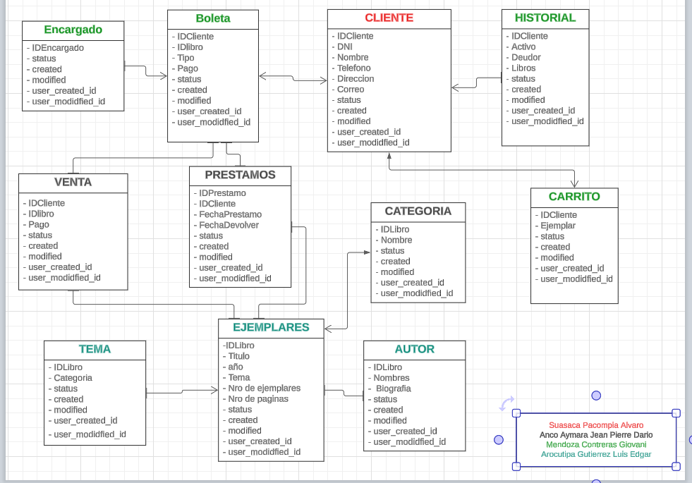
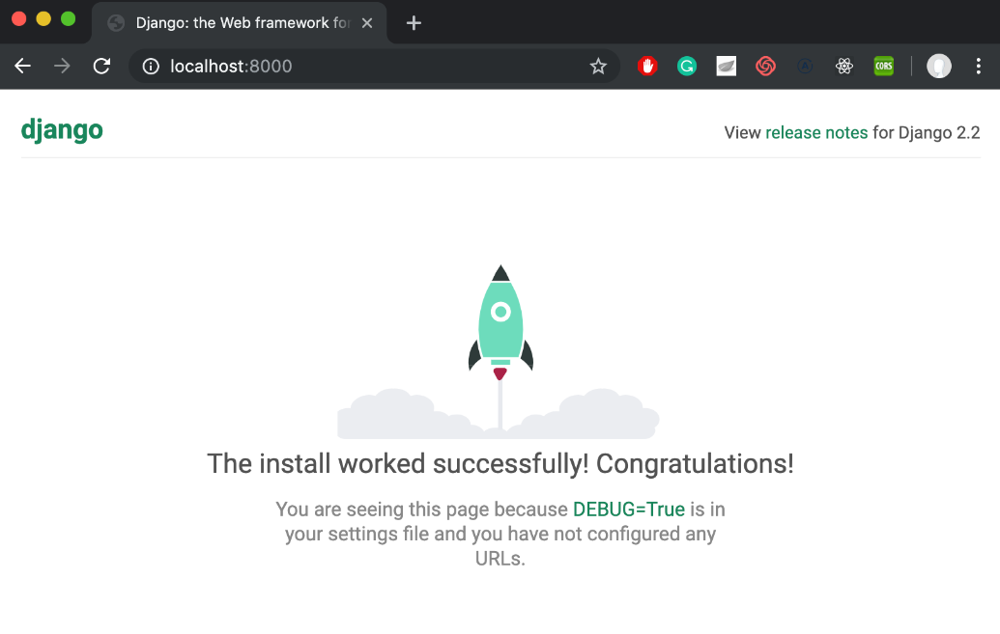
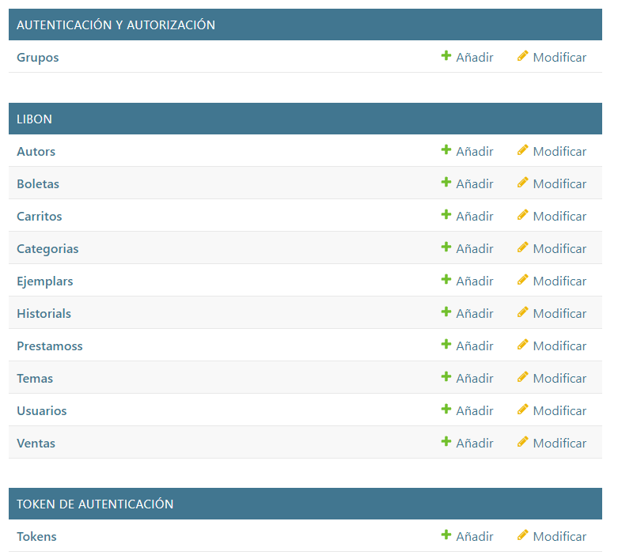
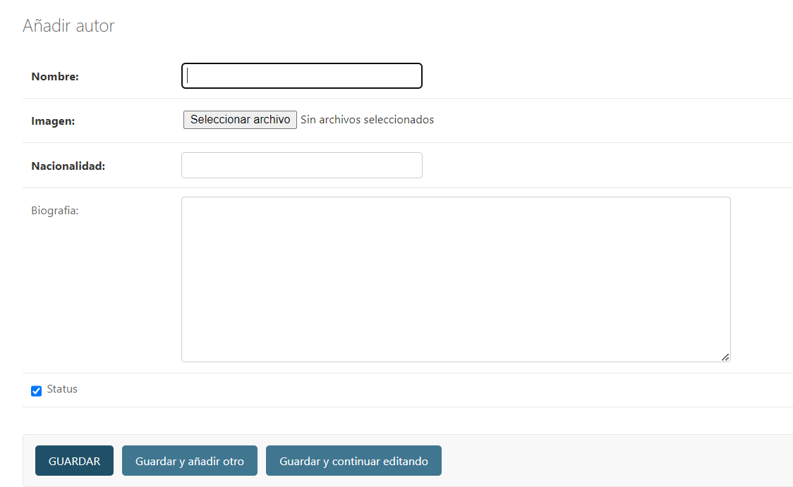
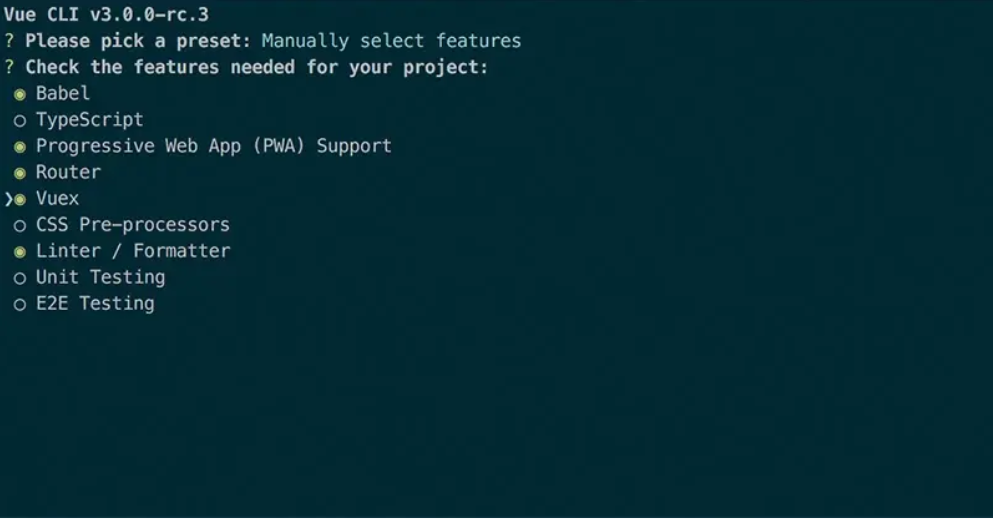
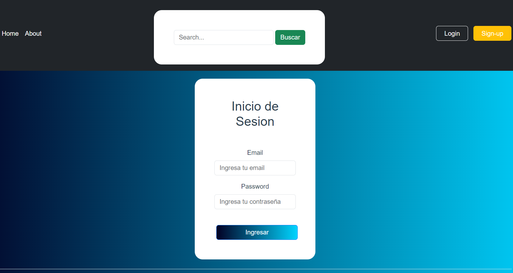
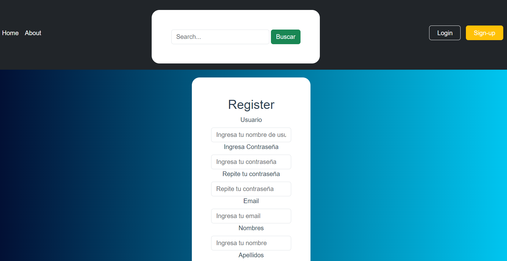
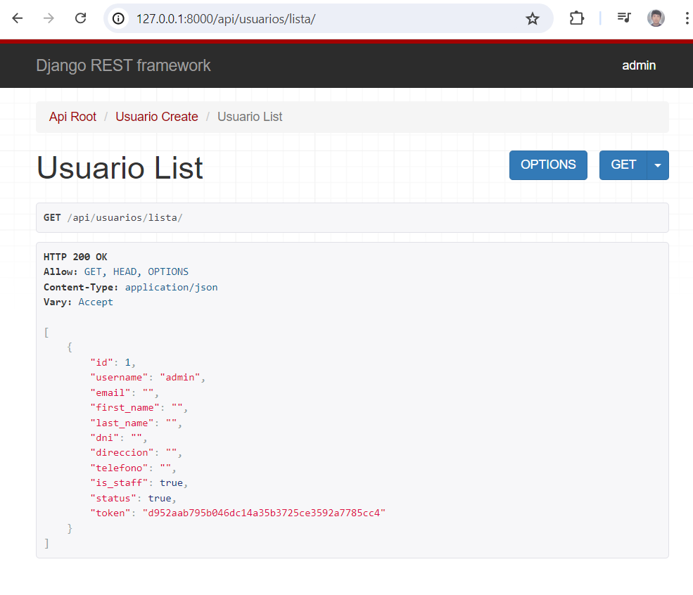
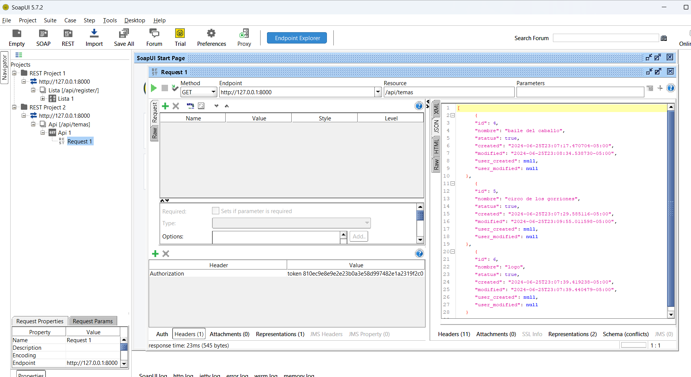
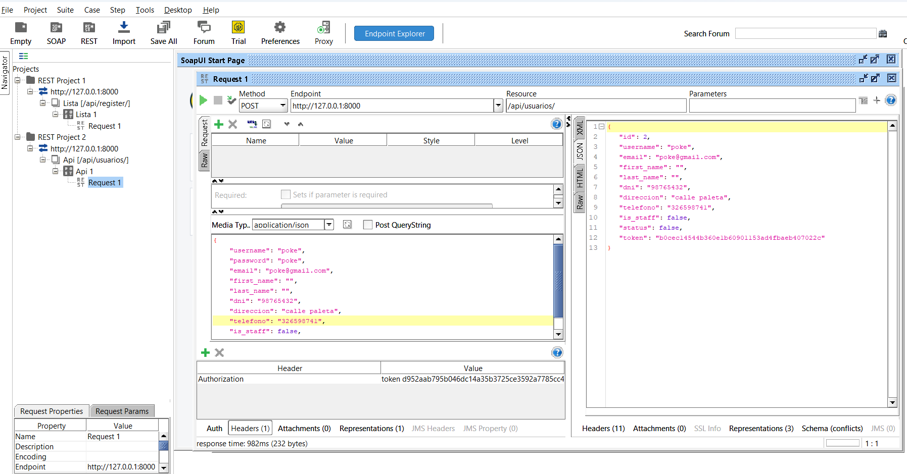

<table>
    <theader>
        <tr>
            <td style="width:25%;"></td>
            <td>
                UNIVERSIDAD NACIONAL DE SAN AGUSTIN 
                FACULTAD DE INGENIERÍA DE PRODUCCIÓN Y SERVICIOS 
                DEPARTAMENTO ACADÉMICO DE INGENIERÍA DE SISTEMAS E INFORMÁTICA 
                ESCUELA PROFESIONAL DE INGENIERÍA DE SISTEMAS
            </td>            
        </tr>
    </theader>
    <tbody>
        <tr>
        <td colspan="2">Proyecto web: Desarrollo de una aplicación web para una biblioteca virtual</td>
        </tr>
        <tr>
        <td colspan="2">Fecha:  2022/28/07</td>
        </tr>
    </tbody>
</table>

PROYECTO WEB: LIBON 

<table>
<theader>
<tr><th>INFORMACIÓN BÁSICA</th></tr>
</theader>
<tbody>
    <tr>
        <td>ASIGNATURA:</td><td>Programación Web 2</td>
    </tr>
    <tr>
        <td>SEMESTRE:</td><td>III</td>
    </tr>
    <tr>
        <td>FECHA INICIO:</td><td>18-Jul-2024</td><td>FECHA FIN:</td>
        <td>28-Jul-2024</td><td>DURACIÓN:</td><td>04 horas</td>
    </tr>
    <tr>
        <td colspan="3">DOCENTES:
        <ul>
        <li>Richart Smith Escobedo Quispe - rescobedoq@unsa.edu.pe</li>
        </ul>
        </td>
    </<tr>
      <tr>
        <td colspan="3">Alumnos:
        <ul>
        <li>Anco Aymara Jean Pierre Dario - jancoay@unsa.edu.pe</li>
        <li>Arocutipa Gutierrez Luis Edgar - larocutipa@unsa.edu.pe</li>
        <li>Mendoza Contreras Giovani Angel - gmendozaco@unsa.edu.pe</li>
        <li>Suasaca Pacompia Alvaro Gustavo - asuasaca@unsa.edu.pe</li>
        </ul>
        </td>
    </<tr>
</tdbody>
</table>

#   WebApp con Django

[![License][license]][license-file]
[![Downloads][downloads]][releases]
[![Last Commit][last-commit]][releases]

[![Debian][Debian]][debian-site]
[![Git][Git]][git-site]
[![GitHub][GitHub]][github-site]
[![Vim][Vim]][vim-site]
[![Java][Java]][java-site]

##  Tipo de Sistema
    Se trata de una aplicación web con un backend construido en el framework Django 4 y para el frontend usamos vue js 3 
    estas son las dos tecnologias que usamos en el proyecto, nuestro proyecto permite poder visualizar los diferentes ejemplares 
    con temas y categorias del interes del usuario en el cual el usuario podra reservar su ejemplar una ves ya haya creado 
    su cuenta pues este podra crear una cuenta y asi mismo logearse para poder hacer la reserva del ejemplar en el que este 
    interesado.

##  Requisitos del sistema
    El sistema debe satisfacer los siguientes requisitos funcionales y no funcionales:

    - RQ01 : El sistema esta disponible en Internet a traves de una URL.
    - RQ02 : El sistema debe permitir el inicio/cierre de sesión.
    - RQ03 : El sistema debe permitir poder visualizar los ejemplares antes de ser logeado con detalles como podria ser el autor 
             categoria, tema, precio.
    - RQ04 : El sistema brinda una busqueda por tema, nombre del ejemplar, categoria, autor.
    - RQ05 : Se podra hacer click socbre el ejemplar para ver mas detalles acerca de este, como tambien en los autores en los cuales 
             se puede ver acerca de este.
    - RQ06 : Una ves logeado el usuario podra visualizar botones con los cuales podra reservar su libro.
    - RQ07 : El sistema brindara seguridad al momento de manejar los datos usuario.

##  Modelo de datos
    El modelo de datos esta conformado por las siguientes entidades.

    -   Autor : En esta tabla tendremos el nombre del autor, su respectiva imagen, y detalles como su nacionalidad y 
    biografia ademas de los campos para hacer un seguimiento del objeto en cuestion.
    -   Boleta : En esta tabla podremos ver el cliente como tambien que tipo de accion como venta o prestamo, el pago 
    y los respectivos campos de seguimiento del objeto. 
    -   Carrito : En esta entidad tendremos al cliente, el ejemplar y los campos de seguimiento.
    -   Categoria : En esta tabla tendremos el nombre de la categoria con los campos de seguimiento.
    -   Ejemplar : En esta tabla tendremos el titulo, imagen del ejemplar, su categoria, tema, año, autor, sinopsis, 
    paginas, stock, 
    precio y los campos de seguimiento.
    -   Historial : Esta tabla contiene al cliente, si es duedor, los ejemplares que llevo, sus boletas y los campos de 
    seguimiento
    -   Prestamo : En esta tabla tenemos el ejemplar, cliente, fecha de devolucion y los campos de seguimiento. 
    -   Tema : Tenemos en esta tabla el nombre del tema y los campos de seguimiento.
    -   Usuario : En esta tabla tenemos al nombre de usuario, password, email, nombres, apellidos, dni, telefono, direccion 
    y los campos de seguimiento. 

##  Diccionario de datos

| Autor | | | | | |
| -- | -- | -- | -- | -- | -- |
| Atributo  | Tipo  | Nulo | Clave | Predeterminado | Descripción |
| id  | Numerico| No | Si | Ninguno | Código |
| nombre  | Cadena | No | No | Ninguno | Nombre |
| imagen  | Image | No | No | Ninguno | imagen |
| nacionalidad  | Cadena| No | No | Ninguno | Nacionalidad |
| biografia  | Cadena| No | No | Ninguno | Biografia |
| status  | Boolean | No | No | Ninguno | Estado |
| created  | Date | No | No | Ninguno | Fecha de creacion |
| modified  | Date | No | No | Ninguno | Fecha de modificacion |
| user_created  | Relacion | No | No | Ninguno | Creado por |
| user_modified  | Relacion | No | No | Ninguno | Modificado por |

| Boleta | | | | | |
| -- | -- | -- | -- | -- | -- |
| Atributo  | Tipo  | Nulo | Clave | Predeterminado | Descripción |
| id  | Numerico| No | Si | Ninguno | Código |
| cliente | Relacion | No | No | Ninguno | Nombre del cliente |
| ventas | Relacion | Si | No | Ninguno | Tipo de accion |
| prestamos | Relacion | Si | No | NULL | Tipo de accion |
| pago | double | Si | No | NULL | Tipo de accion |
| status  | Boolean | No | No | Ninguno | Estado |
| created  | Date | No | No | Ninguno | Fecha de creacion |
| modified  | Date | No | No | Ninguno | Fecha de modificacion |
| user_created  | Relacion | No | No | Ninguno | Creado por |
| user_modified  | Relacion | No | No | Ninguno | Modificado por |

| Carrito | | | | | |
| -- | -- | -- | -- | -- | -- |
| Atributo  | Tipo  | Nulo | Clave | Predeterminado | Descripción |
| id  | Numerico| No | Si | Ninguno | Código |
| cliente | Relacion | No | No | Ninguno | Nombre del cliente |
| ejemplar | Relacion | Si | No | Ninguno | Tipo de accion |
| status  | Boolean | No | No | Ninguno | Estado |
| created  | Date | No | No | Ninguno | Fecha de creacion |
| modified  | Date | No | No | Ninguno | Fecha de modificacion |
| user_created  | Relacion | No | No | Ninguno | Creado por |
| user_modified  | Relacion | No | No | Ninguno | Modificado por |

| Categoria | | | | | |
| -- | -- | -- | -- | -- | -- |
| Atributo  | Tipo  | Nulo | Clave | Predeterminado | Descripción |
| id  | Numerico| No | Si | Ninguno | Código |
| nombre | Cadena | No | No | Ninguno | Nombre de la categoria |
| status  | Boolean | No | No | Ninguno | Estado |
| created  | Date | No | No | Ninguno | Fecha de creacion |
| modified  | Date | No | No | Ninguno | Fecha de modificacion |
| user_created  | Relacion | No | No | Ninguno | Creado por |
| user_modified  | Relacion | No | No | Ninguno | Modificado por |

| Ejemplar | | | | | |
| -- | -- | -- | -- | -- | -- |
| Atributo  | Tipo  | Nulo | Clave | Predeterminado | Descripción |
| id  | Numerico| No | Si | Ninguno | Código |
| titulo  | Cadena | No | No | Ninguno | Nombre |
| imagen  | Image | No | No | Ninguno | imagen |
| categoria  | Cadena | No | No | Ninguno | Tipo de categoria |
| tema  | Cadena | No | No | Ninguno | Tipo de tema |
| año  | Cadena | No | No | Ninguno | año publicado |
| autor  | Relacion | No | No | Ninguno | Nombre del autor |
| sinopsis  | Cadena | No | No | Ninguno | Resumen |
| paginas  | Integer | No | No | Ninguno | Numero de paginas |
| stock  | Integer | No | No | Ninguno | Cantidad |
| precio  | Double | No | No | Ninguno | Costo |
| status  | Boolean | No | No | Ninguno | Estado |
| created  | Date | No | No | Ninguno | Fecha de creacion |
| modified  | Date | No | No | Ninguno | Fecha de modificacion |
| user_created  | Relacion | No | No | Ninguno | Creado por |
| user_modified  | Relacion | No | No | Ninguno | Modificado por |

| Historial | | | | | |
| -- | -- | -- | -- | -- | -- |
| Atributo  | Tipo  | Nulo | Clave | Predeterminado | Descripción |
| id  | Numerico| No | Si | Ninguno | Código |
| cliente | Relacion | No | No | Ninguno | Nombre del cliente |
| deudor | Boolean | Si | No | Ninguno | Penalidad |
| ejemplares | Relacion | Si | No | NULL | relacion de ejemplares |
| boletas | Relacion | Si | No | NULL | Relacion de boletas |
| status  | Boolean | No | No | Ninguno | Estado |
| created  | Date | No | No | Ninguno | Fecha de creacion |
| modified  | Date | No | No | Ninguno | Fecha de modificacion |
| user_created  | Relacion | No | No | Ninguno | Creado por |
| user_modified  | Relacion | No | No | Ninguno | Modificado por |

| Tema | | | | | |
| -- | -- | -- | -- | -- | -- |
| Atributo  | Tipo  | Nulo | Clave | Predeterminado | Descripción |
| id  | Numerico| No | Si | Ninguno | Código |
| nombre | Cadena | No | No | Ninguno | Nombre del tema |
| status  | Boolean | No | No | Ninguno | Estado |
| created  | Date | No | No | Ninguno | Fecha de creacion |
| modified  | Date | No | No | Ninguno | Fecha de modificacion |
| user_created  | Relacion | No | No | Ninguno | Creado por |
| user_modified  | Relacion | No | No | Ninguno | Modificado por |

| Ejemplar | | | | | |
| -- | -- | -- | -- | -- | -- |
| Atributo  | Tipo  | Nulo | Clave | Predeterminado | Descripción |
| id  | Numerico| No | Si | Ninguno | Código |
| username  | Cadena | No | No | Ninguno | Nombre de usuario |
| password  | password | No | No | Ninguno | Contraseña |
| email  | Email | No | No | Ninguno | Correo |
| first_name  | Cadena | No | No | Ninguno | Nombre |
| last_name  | Cadena | No | No | Ninguno | Apellidos |
| dni  | Cadena | No | No | Ninguno | Nro de identidad |
| telefono  | Cadena | No | No | Ninguno | Nro de telefono |
| direccion  | Cadena | No | No | Ninguno | Referencia |
| status  | Boolean | No | No | Ninguno | Estado |
| created  | Date | No | No | Ninguno | Fecha de creacion |
| modified  | Date | No | No | Ninguno | Fecha de modificacion |
| user_created  | Relacion | No | No | Ninguno | Creado por |
| user_modified  | Relacion | No | No | Ninguno | Modificado por |

##  Diagrama Entidad-Relación
    

    1. Autor: Esta tabla tiene relacion de muchos a uno con los campos user_created y user modified pues se relaciona con los usuarios que los crean o los modifiquen
    2. Boleta: Tiene relacion de muchos a muchos con ventas y prestamos, tiene relacion de muchos a uno con los campos user_created y user modified pues se relaciona con los usuarios que los crean o los modifiquen
    3. Carrito: Relacion de uno a uno con el usuario y de muchos a muchos con el ejemplar tiene relacion de muchos a uno con los campos user_created y user modified pues se relaciona con los usuarios que los crean o los modifiquen

##  Administración con Django
    
    -  Para poder comenzar con nuestro backend basado en django tenemos que crear un entorno virtual luego activarlo e 
    instalamos django con los sgtes pasos (para esto ya deberias de tener python y si no es asi lo podras descargar de la 
    pagina oficial de python):
       
       mkdir entorno
       cd entorno
       python3.6 -mvenv myvenv
       source myvenv/bin/activate
       pip install django~=4.2.11
       
    -  Ahora ya tenemos django en nuestro entorno virtual crearemos nuestro proyecto con: 
    
       django-admin startproject libreria .
       
    -  Tendremos algo como esto:
    
       Proyecto
        ├───manage.py
        ├───libreria
        │        settings.py
        │        urls.py
        │        wsgi.py
        │        __init__.py
        └───requirements.txt
    -  Podemos configurar el archivo settings como definiendo tu region e idioma

       TIME_ZONE = 'America/Lima
       LANGUAGE_CODE = 'es'

    -  Ahora podemos crear nuestra base de datos haciendo migrate, y hacer correr nuestro servidor con runserver:

       python manage.py migrate
       python manage.py runserver

    -  Crearemos nuestra app y procederemos a registrarlo en el archivo settings:

        python manage.py startapp libon

        settings.py
          INSTALLED_APPS = [
            ...
            'libon',
          ]

    -  Deberia de quedar de esta manera:

        Proyecto
          ├── libon
          │   ├── __init__.py
          │   ├── admin.py
          │   ├── apps.py
          │   ├── migrations
          │   │   └── __init__.py
          │   ├── models.py
          │   ├── tests.py
          │   └── views.py
          ├── libreria
          │   ├── __init__.py
          │   ├── settings.py
          │   ├── urls.py
          │   └── wsgi.py
          ├── manage.py
          ├── db.sqlite3
          └── requirements.txt

    -  Ahora podemos crear nuestros modelos, en nuestro caso creamos un nuevo carpeta modelo para tener nuestro archivos 
    entonces tenemos que realizar los sgtes comandos:

        mv models.py models.py.deprecated
        mkdir models

    -  Aqui tenemos una vista del modelo autor.py
       class Autor(models.Model):
            nombre = models.CharField(max_length=200)
            imagen = models.ImageField(upload_to='autores', default='imagen_default.png', verbose_name='imagen')
            nacionalidad = models.CharField(max_length=50)
            biografia = models.TextField(null=True, blank=True)
            status = models.BooleanField(default=True)
            created = models.DateTimeField(auto_now_add=True)
            modified = models.DateTimeField(auto_now=True)
            user_created = models.ForeignKey(settings.AUTH_USER_MODEL, related_name='autors_created', }
                                                on_delete=models.SET_NULL, 
                                                null=True, editable=False)
            user_modified = models.ForeignKey(settings.AUTH_USER_MODEL, related_name='autors_modified', 
                                                on_delete=models.SET_NULL, 
                                                null=True, editable=False)
        
            def __str__(self):
                return self.nombre

        En nuestro admin tenemos una vista desde el administrador de django para esto crearemos nuestro super usario con:

        python manage.py createsuperuser

        

##  Plantillas Bootstrap
    Se seleccionó la siguiente plantilla para el usuario final (No administrador).

    Demo online:
    URL: ...

    Se muestran las actividades realizadas para adecuación de plantillas, vistas, formularios en Django.
    Nuestro frontend esta elaborado con vue js 3 por lo que primeramente debemos de tener node js descargado (si no lo 
    tenemos podemos descargarlo en https://nodejs.org/en ) luego tenemos que instalar vue js y crear nuestro proyecto:

      npm install -g @vue/cli
      vue create my-project

    Ahora definimos el nombre y la version que deseamos tambien debemos de seleccionar la caracteristicas que deseamos 
    en nuestra aplicacion.

    Ahora debemos de tener un directorio similar a esto 

    El framework nos presenta la capacidad de crear views como por ejemplo loginView en la cual exportamos componentes 
    los cuales nos ayudara en la interaccion de los usuarios nuestras plantillas tendran directivas para poder manejar 
    los datos o tambien para poder ver diferentes ejemplares y otras directivas mas.

    1. Login:
    
    <template>
    

    

        <form @submit.prevent="submitForm" class="login-form mx-auto">
            <h4 class="text-center">Inicio de Sesion</h4>
            

            <label class="form-label">Email</label>
            <input v-model="email" type="email" placeholder="Ingresa tu email" class="form-control">
            <small v-if="errors.email" class="text-danger">{{ errors.email }}</small>
            

            

            <label class="form-label">Password</label>
            <input v-model="password" type="password" placeholder="Ingresa tu contraseña" class="form-control">
            <small v-if="errors.password" class="text-danger">{{ errors.password }}</small>
            

            

            <button type="submit" class="btn btn-primary mt-4">Ingresar</button>
            

        </form>
    

    

    </template>

       Aqui tenemos nuestra plantilla de login la cual cuenta con dos inputs email y password las cuales llevan 
       directivas v-model para la captura de los datos del formulario al hacer submit y v-if por si salta algun 
       error al querer enviar datos erroneos.
       
    2. Register:

       Nuestro register tiene similar plantilla al del login pero este tiene mas campos para realizar el logeado del 
       usuario con las directivas v-model para los datos ingresados y v-if al querer enviar datos erroneos.

    3. Search:

       Para nuestra vista search tenemos presenta una nueva directiva el cual es v-for la cual imprimira todos los 
       ejemplares que tenga relacion al input de busqueda 
       
    4. Carrito

##  CRUD - Core Business - Clientes finales
    El núcleo de negocio del sistema de libreria donde el usuario puede ver los ejemplares y realizar una reserva, que 
    empieza desde que:
    
    1. El usuario inicia sesión.

       Enviamos los datos a una url rest framework django con la ayuda de axios con metodo post, una ves confirmado 
       mediante una promesa nos dara su respuesta con el token y algunos datos del usuario tambien cambiando los 
       estados del store para posibles cambios si no fuese asi nos enviara el error permitiendo ver algunas opciones 
       extras para poder reservar el ejemplar.
       
    2. El usuario puede crear una cuenta.

       De similar forma a la de innicio de sesion enviamos los datos para poder registrarse con axios en metodo post 
       y al confirmar mediante una promesa nos devolvera la respuesta de creado no cambiara los estados del store pues 
       solo creara en nuestra base de datos y nos devolvera al inicio de la pagina para poder logearnos o simplemente 
       ver la pagina.
       
    3. El usuario puede usar el carrito para reservar.
    
    4. El alumno puede tener la posibilidad de anular una reserva.
    5. El usuario puede hacer busqueda por categoria, tema, autor.

       
    6. El alumno cierra sesión.

##  Servicios mediante una API RESTful
    Se ha creado la aplicación que pondra a disposición nuestra información para ser consumida por otros clientes HTTP para 
    esto usamos Django Rest Framework y Soap ui .
    

    1. Tenemos para el metodo GET : 
       -  Con el método get se devolverá la lista de usuarios lo mostraremos con django rest framework pues con este 
       crearemos una vista para poder ver la lista de usuarios
       

       
       -  lista de ejemplares por ejemplo tenemos nuestro serializer para Ejemplares
       
          class EjemplarSerializer(serializers.ModelSerializer):
                    nombre_autor = serializers.SerializerMethodField()
                    nombre_categoria = serializers.ReadOnlyField(source='categoria.nombre')
                    nombre_tema = serializers.SerializerMethodField()
                    class Meta:
                        model = ejemplar.Ejemplar
                        fields = ('id', 'titulo', 'imagen', 'año', 'sinopsis', 'paginas', 'stock', 'precio', 'status', 
                        'categoria', 'nombre_categoria', 'tema', 'autor', 'nombre_autor', 'nombre_tema')
                        filterset_class = EjemplarFilter
                
                    def get_nombre_autor(self, obj):
                        autores = obj.autor.all()
                        return [autor.nombre for autor in autores]
                    
                    def get_nombre_tema(self, obj):
                        temas = obj.tema.all()
                        return [tema.nombre for tema in temas]

            Con esta clase crearemos sus campos basados en el modelo indicado el cual seria ejemplares, con la clase 
            meta es la que asociamos al serializador luego sus campos y filtramos las instancias del modelo ejemplar, 
            luego tenemos el metodo con el podemos buscar el nombre del autor asociado(get_nombre_autor) y tambien 
            uno que busque el tema con el que este asociado(get_nombre_tema)
       
       lista de temas esta tambien en metodo get lo mostraremos en soap ui

       lista de autores, lista de categorias,lista de historial, 
       lista de venta, lista de carritos, el usuario sobre todo vea esta información en cualquier otro medio. En 
       formato JSON. 
       
    2. POST : Con este método tendremos a crear usuario
    

    
    logear usuario, con lo que al llenar los campos necesarios se devolvera la informacion de nuestro usuario. En 
    formato JSON.
    
    @api_view(['POST'])
    def login(request):
        user = get_object_or_404(User, email=request.data['email'])
    
        if not user.check_password(request.data['password']):
            return Response({"error":"Invalid Password"}, status=status.HTTP_400_BAD_REQUEST)
        
        token, created = Token.objects.get_or_create(user=user)
        serializer = UsuarioSerializer(instance=user)
        return Response({"token":token.key, 
                         "user":serializer.data}, 
                         status=status.HTTP_200_OK)

    Para poder logearnos usamos la funcion login la cual estara con metodo post y se buscara al usuario con 
    get_object_or_404 lo cual nos ayuda bastante al momento de hacer el codigo luego se comprueba que sea la contraseña 
    correcta, entonces buscamos el valor del token con validando antes que exista el token con created que nos devolvera 
    un valor booleano, con serializer hacemos una instancia a UsuarioSerializer con esto tendra los datos del usuario 
    para poder procesarlos y por ultimo respondemos con el token y los datos del usuario.

##  Operaciones asíncronas AJAX

    Reactividad en Vue.js
    
    Vue.js está diseñado para ser un framework reactivo. Esto significa que Vue automáticamente actualiza la interfaz de 
    usuario cuando los datos cambian. Aquí están las claves para entender cómo funciona esto:
    
    Sistema de Reactividad:
    
    1. Data Binding: En Vue.js, los datos en el modelo están vinculados a la vista. Esto significa que cualquier cambio en 
    los datos se refleja automáticamente en la vista. Vue utiliza un sistema de reactividad basado en observadores que 
    detecta los cambios en los datos y actualiza la vista en consecuencia.
    
    2. Virtual DOM: Vue.js utiliza un Virtual DOM para realizar actualizaciones eficientes. En lugar de actualizar el DOM 
    real directamente cada vez que hay un cambio en los datos, Vue primero actualiza un Virtual DOM y luego aplica solo las 
    diferencias (o diffs) al DOM real. Esto mejora el rendimiento al minimizar las operaciones costosas en el DOM.
    
    Componente de Actualización:
    
    1. Componentes Reactivos: Cuando cambias datos en un componente Vue, el componente y sus componentes hijos se actualizan 
    automáticamente. Esto se hace de manera reactiva y no requiere que hagas una solicitud AJAX para cada actualización. 

##  Investigación: Email, Upload.
    - Email: Se utilizará la funcionalidad del uso de envío de correos electrónicos cuando el proceso de inscripciones 
    culmine y al profesor le llegue la lista de alumnos inscritos en sus grupos a cargo.
    - Upload: Se utilizará esta funcionalidad para subír, archivos CSV para importar y exportar información en el sistema.
    Se muestran los pasos realizados para su funcionamiento correcto.
    ...

Github del proyecto:

URL en Heroku:

URL Playlist YouTube.
Producción de un PlayList en Youtube explicando cada una de los requerimientos.
Video 01 - Sistema - Requisitos.
Video 02 - Modelo de datos - DD - DER.
etc…

## REFERENCIAS
-   

#

[license]: https://img.shields.io/github/license/rescobedoq/pw2?label=rescobedoq
[license-file]: https://github.com/rescobedoq/pw2/blob/main/LICENSE

[downloads]: https://img.shields.io/github/downloads/rescobedoq/pw2/total?label=Downloads
[releases]: https://github.com/rescobedoq/pw2/releases/

[last-commit]: https://img.shields.io/github/last-commit/rescobedoq/pw2?label=Last%20Commit

[Debian]: https://img.shields.io/badge/Debian-D70A53?style=for-the-badge&logo=debian&logoColor=white
[debian-site]: https://www.debian.org/index.es.html

[Git]: https://img.shields.io/badge/git-%23F05033.svg?style=for-the-badge&logo=git&logoColor=white
[git-site]: https://git-scm.com/

[GitHub]: https://img.shields.io/badge/github-%23121011.svg?style=for-the-badge&logo=github&logoColor=white
[github-site]: https://github.com/

[Vim]: https://img.shields.io/badge/VIM-%2311AB00.svg?style=for-the-badge&logo=vim&logoColor=white
[vim-site]: https://www.vim.org/

[Java]: https://img.shields.io/badge/java-%23ED8B00.svg?style=for-the-badge&logo=java&logoColor=white
[java-site]: https://docs.oracle.com/javase/tutorial/

[![Debian][Debian]][debian-site]
[![Git][Git]][git-site]
[![GitHub][GitHub]][github-site]
[![Vim][Vim]][vim-site]
[![Java][Java]][java-site]

[![License][license]][license-file]
[![Downloads][downloads]][releases]
[![Last Commit][last-commit]][releases]
